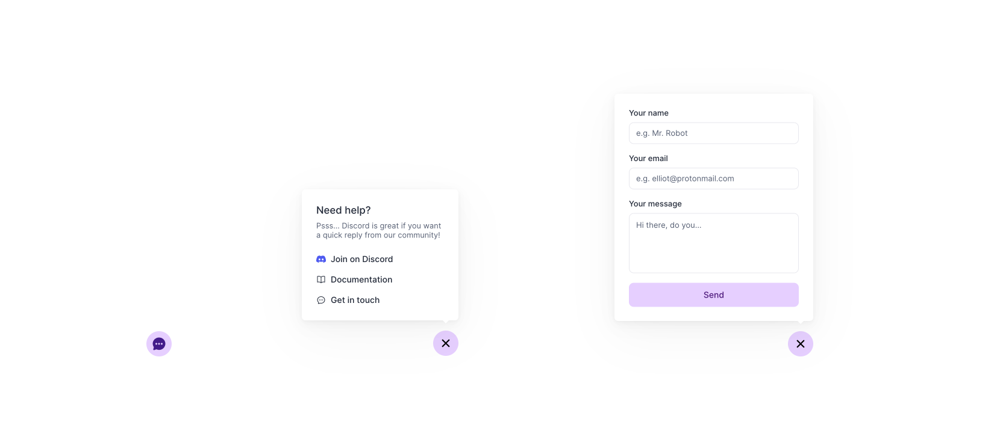

# Example NextJS Advanced Contact Form

This NextJS app shows how to build a contact form using Plain's [Custom Timeline Entries](https://docs.plain.com/recipes/custom-timeline-entry-upsert) and [Typescript SDK](https://www.npmjs.com/package/@team-plain/typescript-sdk).

Using this contact form you will be able to quickly prioritise customers in Plain by what they are getting in touch about and how urgent it is.

This example mainly consists of one [Next.js API Route](https://nextjs.org/docs/api-routes/introduction) (`/api/contact-form.tsx`) which calls the Plain API to:

- Create the customer within Plain if they don't exist
- Create a Custom Timeline Entry with the contents of the contact form 
- Open an issue with the right priority

You can see what it looks like here https://example-nextjs-advanced-contact-form.vercel.app/ but you will need to run this example yourself if you want to see what it looks like within Plain as someone providing support.

This is meant as a starting point that you can customise to specifically fit your product and needs.



### Interesting files:

- The API route: [./pages/api/contact-form.ts](./pages/api/contact-form.ts)
- The contact form react component: [./src/components/contactForm.tsx](./src/components/contactForm.tsx)

### Running the example:

You will need an API key from Plain first. [Check out our docs](https://docs.plain.com/core-api/authentication) on how to generate an API key.

For this demo you will need to grant the API key the following permissions:

- `timeline:create`
- `timeline:edit`
- `customer:create`
- `customer:edit`
- `customer:read`
- `issue:create`
- `issue:read`
- `issueType:read`

You will then have to create a few issue types in settings and copy their IDs. This example assumes you have an issue type for bugs, demo request, feature suggestions, security reports and general questions.

You will then need to make a file called  `.env.local` file with the following details:

```bash
# Your Plain API Key:
PLAIN_API_KEY=plainApiKey_XXX

# The issue type ids you created:
NEXT_PUBLIC_PLAIN_ISSUE_TYPE_ID_BUG=it_XXX
NEXT_PUBLIC_PLAIN_ISSUE_TYPE_ID_DEMO=it_XXX
NEXT_PUBLIC_PLAIN_ISSUE_TYPE_ID_FEATURE=it_XXX
NEXT_PUBLIC_PLAIN_ISSUE_TYPE_ID_SECURITY=it_XXX
NEXT_PUBLIC_PLAIN_ISSUE_TYPE_ID_QUESTION=it_XXX
```

After that you can run `npm install` followed by `npm run dev` to run the NextJS app and try it out!
