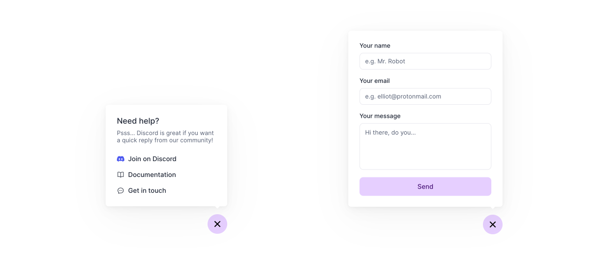

# Example NextJS Floating Contact Form

This NextJS app shows how to build a floating support bubble using Plain's [Custom Timeline Entries](https://www.plain.com/docs/custom-timeline-entries) and [Typescript SDK](https://www.npmjs.com/package/@team-plain/typescript-sdk).

Using this contact form customers can easily get in touch with you, or jump to your discord community or docs.

This example mainly consists of one [Next.js API Route](https://nextjs.org/docs/api-routes/introduction) (`/api/contact-form.tsx`) which calls the Plain API to:

- Create the customer within Plain if they don't exist
- Create a Custom Timeline Entry with the contents of the contact form 

You can see what it looks like here https://example-nextjs-floating-form.vercel.app/ but you will need to run this example yourself if you want to see what it looks like within Plain as someone providing support.

This is meant as a starting point that you can customise to specifically fit your product and needs.



### Interesting files:

- The API route: [./pages/api/contact-form.ts](./pages/api/contact-form.ts) 
- The contact form react component: [./src/components/contactForm.tsx](./src/components/contactForm.tsx)

### Running the example:

You will need an API key from Plain first. [Check out our docs](https://www.plain.com/docs/graphql-api/authentication) on how to generate an API key.

For this demo you will need to grant the API key the following permissions:

- `timeline:create`
- `timeline:edit`
- `customer:create`
- `customer:edit`
- `customer:read`

You will then need to make a file called  `.env.local` file with the following details:

```bash
# Your Plain API Key:
PLAIN_API_KEY=plainApiKey_XXX
```

After that you can run `npm install` followed by `npm run dev` to run the NextJS app and try it out!
